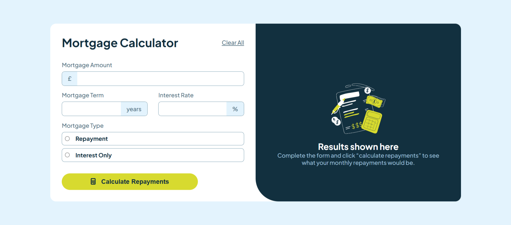

# Frontend Mentor - Mortgage repayment calculator solution

This is a solution to the [Mortgage repayment calculator challenge on Frontend Mentor](https://www.frontendmentor.io/challenges/mortgage-repayment-calculator-Galx1LXK73). Frontend Mentor challenges help you improve your coding skills by building realistic projects. 

## Table of contents

- [Overview](#overview)
  - [The challenge](#the-challenge)
  - [Screenshot](#screenshot)
  - [Links](#links)
- [My process](#my-process)
  - [Built with](#built-with)
  - [Useful resources](#useful-resources)
- [Author](#author)

## Overview

### The challenge

Users should be able to:

- Input mortgage information and see monthly repayment and total repayment amounts after submitting the form
- See form validation messages if any field is incomplete
- Complete the form only using their keyboard
- View the optimal layout for the interface depending on their device's screen size
- See hover and focus states for all interactive elements on the page

### Screenshot

### Links

- Solution URL: [Mortgage Repayment Calculator Solution](https://www.frontendmentor.io/solutions/mortgage-repayment-calculator-JQl-HXX7aQ)
- Live Site URL: [Mortgage Repayment Calculator Live Site](https://mjspitta.github.io/mortgage-repayment-calculator1/)

## My process

### Built with

- Semantic HTML5 markup
- CSS custom properties
- Flexbox

### Useful resources

- [:has pseudo-class](https://developer.mozilla.org/en-US/docs/Web/CSS/:has) - This helped me in styling the border of the input containers when active.
- [:focus-within pseudo-class](https://developer.mozilla.org/en-US/docs/Web/CSS/:focus-within) - This helped me in styling the radio inputs whenever one is selected/checked.

## Author

- Frontend Mentor - [@MJspitta](https://www.frontendmentor.io/profile/MJspitta)
- Twitter - [@madu_jang](https://x.com/madu_jang)

